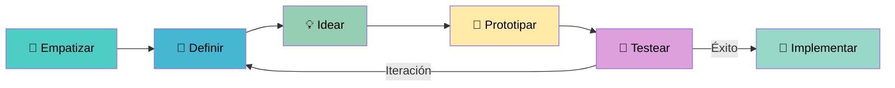

# 🎨 Canvas de Design Thinking & Business Model Canvas

**Proyecto:** Trabajo 3 — IRNA · Universidad Nacional de Colombia  
**Semestre:** 9 · 2026  
**Asignatura:** Redes Neuronales Aplicadas

---

## 🗺️ Design Thinking Canvas

El proceso de Design Thinking se aplicó como marco metodológico para diseñar soluciones centradas en el usuario antes de implementar los modelos de Machine Learning. A continuación se describen las cinco fases.

---

### Fase 1: 🤝 EMPATIZAR

> *Comprender profundamente a los usuarios, sus necesidades, dolores y contextos*

#### 👤 Personas de Usuario

---

**Persona 1 — El Viajero Colombiano**

| Atributo | Detalle |
|----------|---------|
| **Nombre** | Valentina Ríos, 29 años |
| **Ocupación** | Profesional independiente, Bogotá |
| **Frecuencia de viaje** | 3–5 viajes/año dentro de Colombia |
| **Dispositivos** | Smartphone (Android), laptop |
| **Frustraciones** | No sabe cuándo los destinos están saturados; las apps de viaje no personalizan según sus gustos; incertidumbre en precios y disponibilidad |
| **Necesidades** | Recomendaciones auténticas y personalizadas; información sobre demanda y mejores épocas para viajar |
| **Motivaciones** | Descubrir destinos menos conocidos; optimizar el presupuesto; experiencias culturales únicas |
| **Cita representativa** | *"Siempre termino yendo a los mismos lugares porque no sé qué más me puede gustar."* |

---

**Persona 2 — El Operador de Transporte**

| Atributo | Detalle |
|----------|---------|
| **Nombre** | Carlos Mendoza, 47 años |
| **Ocupación** | Gerente de operaciones, empresa de buses intermunicipales |
| **Responsabilidades** | Asignación de flota, control de rutas, gestión de conductores |
| **Frustraciones** | Demanda impredecible en temporadas; subutilización de vehículos en temporada baja; accidentes por conductores distraídos |
| **Necesidades** | Pronósticos confiables de pasajeros; alertas de comportamiento de conductores; planificación anticipada |
| **Motivaciones** | Reducir costos operativos; mejorar la seguridad; aumentar ingresos |
| **Cita representativa** | *"En Semana Santa siempre nos quedamos cortos de buses y en enero sobran. Necesito predecir eso."* |

---

**Persona 3 — El Oficial de Seguridad Vial**

| Atributo | Detalle |
|----------|---------|
| **Nombre** | Inspector Jorge Castaño, 54 años |
| **Ocupación** | Coordinador de seguridad vial, empresa de transporte |
| **Responsabilidades** | Supervisión de conductores, capacitaciones, análisis de incidentes |
| **Frustraciones** | Imposible monitorear manualmente a todos los conductores; las cámaras graban pero nadie revisa el video; falta de datos objetivos |
| **Necesidades** | Sistema automático de detección de distracciones; alertas en tiempo real; reportes históricos |
| **Motivaciones** | Cero accidentes; cumplimiento normativo; proteger la vida de conductores y pasajeros |
| **Cita representativa** | *"Sé que mis conductores usan el celular, pero necesito pruebas objetivas y un sistema que me avise al instante."* |

---

**Persona 4 — El Planificador Turístico**

| Atributo | Detalle |
|----------|---------|
| **Nombre** | Daniela Ospina, 35 años |
| **Ocupación** | Analista en ProColombia / Entidad de turismo regional |
| **Responsabilidades** | Análisis de flujos turísticos, estrategias de marketing, distribución de turistas |
| **Frustraciones** | Datos de demanda fragmentados; falta de predicciones a corto plazo; concentración turística en pocos destinos |
| **Necesidades** | Pronósticos de demanda por destino; identificación de destinos emergentes; herramientas de decisión |
| **Motivaciones** | Distribuir turismo equitativamente; potenciar destinos emergentes; sostener el ecosistema turístico |

---

#### 🗺️ Mapa de Empatía (Síntesis)

```
┌─────────────────────────────────────────────────────────────────┐
│                     MAPA DE EMPATÍA                             │
├──────────────────────┬──────────────────────────────────────────┤
│  QUÉ PIENSA Y SIENTE │  QUÉ VE                                  │
│  • Incertidumbre     │  • Precios fluctuantes                   │
│  • Deseo de          │  • Recomendaciones genéricas              │
│    experiencias      │  • Accidentes en carreteras              │
│    auténticas        │  • Buses llenos / vacíos                 │
├──────────────────────┼──────────────────────────────────────────┤
│  QUÉ DICE Y HACE     │  QUÉ OYE                                 │
│  • Busca en Google   │  • "Este destino está de moda"           │
│  • Pregunta amigos   │  • "Hay mucho trancón"                   │
│  • Reserva tarde     │  • "El conductor iba distraído"          │
├──────────────────────┼──────────────────────────────────────────┤
│  DOLORES             │  GANANCIAS                               │
│  • Saturación        │  • Viaje planificado y seguro            │
│  • Riesgo vial       │  • Recomendaciones personalizadas        │
│  • Incertidumbre     │  • Flota bien asignada                   │
│  • Recursos mal      │  • Reducción de accidentes               │
│    asignados         │  • Decisiones basadas en datos           │
└──────────────────────┴──────────────────────────────────────────┘
```

---

### Fase 2: 🎯 DEFINIR

> *Sintetizar los hallazgos de la empatía en declaraciones de problema claras y accionables*

#### Point-of-View (POV) Statements

**Módulo 1 — Predicción de Demanda:**

> *Los operadores de transporte turístico necesitan **predecir con anticipación la demanda de pasajeros** por destino colombiano porque la variabilidad estacional genera subutilización o escasez de flota, afectando tanto la rentabilidad como la satisfacción del viajero.*

**Módulo 2 — Clasificación de Conductores:**

> *Los inspectores de seguridad vial necesitan **detectar automáticamente comportamientos distraídos en conductores** porque el monitoreo manual es inviable a escala y las distracciones al volante representan la principal causa de accidentes de tránsito en Colombia.*

**Módulo 3 — Sistema de Recomendación:**

> *Los viajeros colombianos necesitan **recibir recomendaciones de destinos turísticos personalizadas** porque las plataformas actuales ofrecen sugerencias genéricas que no reflejan sus preferencias individuales, limitando su exploración del vasto territorio nacional y latinoamericano.*

#### How Might We (HMW) Questions

| Módulo | HMW Question |
|--------|-------------|
| 1 | ¿Cómo podríamos predecir la demanda turística diaria con semanas de anticipación y precisión suficiente para planificar la operación de transporte? |
| 1 | ¿Cómo podríamos representar los patrones estacionales, festivos y climáticos en un modelo de series de tiempo? |
| 2 | ¿Cómo podríamos distinguir automáticamente entre 10 tipos de conducción distraída a partir de imágenes de cámara? |
| 2 | ¿Cómo podríamos aprovechar modelos preentrenados para compensar la escasez de datos etiquetados? |
| 3 | ¿Cómo podríamos aprender preferencias implícitas de usuarios sin datos explícitos de calificación? |
| 3 | ¿Cómo podríamos recomendar destinos menos conocidos evitando el sesgo hacia los destinos populares? |

---

### Fase 3: 💡 IDEAR

> *Generar la mayor cantidad de ideas posibles para resolver los problemas definidos*

#### Sesión de Brainstorming — Resultados

**Ideas para Módulo 1 (Series de Tiempo / Demanda):**

| # | Idea | Viabilidad | Impacto |
|---|------|-----------|---------|
| 1 | LSTM multivariado con features de clima, festivos, precios | Alta | Alto |
| 2 | Transformer (Time-Series Transformer) para capturar dependencias largas | Media | Alto |
| 3 | Ensemble LSTM + ARIMA | Media | Medio |
| 4 | **LSTM univariado con ventana deslizante de 30 días** ✅ | Alta | Alto |
| 5 | Prophet (Facebook) + ajuste manual de estacionalidad | Alta | Medio |
| 6 | LSTM por destino con transfer learning entre destinos similares | Baja | Alto |

**Ideas para Módulo 2 (Visión por Computadora):**

| # | Idea | Viabilidad | Impacto |
|---|------|-----------|---------|
| 1 | CNN desde cero con arquitectura personalizada | Media | Medio |
| 2 | **ResNet18 con Transfer Learning (fine-tuning layer4)** ✅ | Alta | Alto |
| 3 | EfficientNet-B0 para balance velocidad/precisión | Media | Alto |
| 4 | Vision Transformer (ViT) | Baja | Alto |
| 5 | Detección de puntos faciales + clasificador SVM | Alta | Medio |
| 6 | YOLO para detección en tiempo real | Media | Alto |

**Ideas para Módulo 3 (Recomendación):**

| # | Idea | Viabilidad | Impacto |
|---|------|-----------|---------|
| 1 | Filtrado colaborativo por memoria (cosine similarity) | Alta | Bajo |
| 2 | Matrix Factorization (SVD) | Alta | Medio |
| 3 | **Neural Collaborative Filtering (NCF)** ✅ | Alta | Alto |
| 4 | Graph Neural Network para relaciones usuario-destino | Baja | Alto |
| 5 | Recomendación con contexto temporal y geolocalización | Media | Alto |
| 6 | Híbrido NCF + Content-Based (descripción del destino) | Media | Alto |

#### Criterios de Selección

Las ideas seleccionadas (✅) fueron elegidas según:
1. **Viabilidad técnica** con el tiempo y datos disponibles
2. **Pertinencia académica** (cubren los temas del curso: LSTM, CNN, Recomendación)
3. **Impacto esperado** en la calidad de las predicciones/recomendaciones
4. **Reproducibilidad** con datos sintéticos o públicos

---

### Fase 4: 🔧 PROTOTIPAR

> *Construir representaciones rápidas de las soluciones para aprender haciendo*

#### Prototipo 1 — LSTM para Demanda de Transporte

**Descripción del prototipo:**

Se construyó un pipeline completo de predicción de series de tiempo:

1. **Generación de datos sintéticos:** Se simularon 15,000 registros de demanda diaria para 10 destinos colombianos, incorporando componentes de tendencia, estacionalidad semanal, picos de temporada alta (junio-julio, diciembre) y ruido aleatorio.

2. **Preprocesamiento:** Normalización con MinMaxScaler por destino; construcción de ventanas deslizantes de 30 días (X: días 1-30, y: día 31).

3. **Arquitectura LSTM:**
   ```
   Input  → [batch, 30, 1]
   LSTM1  → [batch, 30, 64]  (batch_first=True)
   LSTM2  → [batch, 30, 64]
   Output último paso → [batch, 64]
   FC     → [batch, 1]
   ```

4. **Entrenamiento:** Adam (lr=0.001), MSELoss, Early Stopping (patience=10).

5. **Evaluación y pronóstico:** Cálculo de RMSE, MAE, MAPE; pronóstico autorregresivo a 30 días (salida de t+1 es entrada de t+2, etc.).

**Decisiones de diseño:**
- Un modelo por destino para capturar dinámicas individuales
- Dos capas LSTM para capturar patrones de corto y mediano plazo
- Dropout = 0.2 entre capas para regularización

---

#### Prototipo 2 — ResNet18 para Clasificación de Conductores

**Descripción del prototipo:**

1. **Dataset sintético:** 2,000 imágenes generadas programáticamente (200 por clase) simulando las 10 categorías del dataset State Farm. Colores de fondo, figuras geométricas y texto representan cada clase.

2. **Data Augmentation:**
   ```python
   transforms.RandomHorizontalFlip(p=0.5)
   transforms.RandomRotation(degrees=15)
   transforms.ColorJitter(brightness=0.3, contrast=0.3)
   transforms.Normalize(mean=[0.485, 0.456, 0.406],
                        std=[0.229, 0.224, 0.225])
   ```

3. **Estrategia de Transfer Learning:**
   - Cargar ResNet18 con pesos de ImageNet
   - Congelar: `conv1`, `bn1`, `layer1`, `layer2`, `layer3`
   - Fine-tune: `layer4` + FC (`512 → 256 → 10`)
   - Reemplazar `model.fc` con nueva cabeza clasificadora

4. **Entrenamiento:** CrossEntropyLoss, Adam (lr=0.001), 20 épocas, batch_size=32, scheduler ReduceLROnPlateau.

5. **Evaluación:** Classification report completo, matriz de confusión, curvas de aprendizaje.

**Justificación del fine-tuning parcial:**
- Las capas tempranas de ResNet capturan bordes, texturas y patrones genéricos transferibles a cualquier dominio visual
- `layer4` captura características semánticas de alto nivel específicas de la tarea
- Fine-tuning selectivo reduce overfitting con dataset pequeño

---

#### Prototipo 3 — NCF para Recomendación de Viajes

**Descripción del prototipo:**

1. **Dataset sintético:** 500 usuarios, 50 destinos latinoamericanos, ~8,000 interacciones binarias (1 = visitó/le gustó, 0 = no interacción). Se incorporó sesgo de preferencia: usuarios de región caribe prefieren playas; usuarios de interior prefieren ciudades culturales.

2. **Negative Sampling:** Por cada interacción positiva, se muestrean 4 destinos no visitados aleatoriamente como negativos. Esto da balance y permite aprendizaje contrastivo.

3. **Arquitectura NCF:**
   ```
   User ID  → Embedding (500, 32)
   Item ID  → Embedding (50, 32)
               ↓
   Concat   → [batch, 64]
   MLP-1    → [batch, 64]  + ReLU + Dropout(0.2)
   MLP-2    → [batch, 32]  + ReLU + Dropout(0.2)
   MLP-3    → [batch, 16]  + ReLU
   Output   → [batch, 1]   + Sigmoid
   ```

4. **Entrenamiento:** BCELoss, Adam (lr=0.001), 50 épocas, early stopping.

5. **Evaluación top-K:** Para cada usuario, se ordenan todos los destinos por score predicho, se seleccionan top-5 y se evalúa contra las interacciones reales del test set.

6. **Visualización:** PCA de los vectores de embedding de destinos para explorar agrupaciones geográficas/temáticas emergentes.

---

#### Prototipo 4 — Herramienta Web Flask

**Descripción del prototipo:**

Aplicación web que integra los tres modelos entrenados:

- **Backend:** Flask con rutas API REST para cada módulo
- **Frontend:** HTML5 + CSS3 + JavaScript vanilla
- **Módulo 1 Web:** Selector de destino + número de días → gráfico de pronóstico
- **Módulo 2 Web:** Upload de imagen → clasificación con porcentaje de confianza
- **Módulo 3 Web:** Ingreso de ID usuario → lista de top-5 recomendaciones con scores

---

### Fase 5: 🧪 TESTEAR

> *Validar los prototipos con criterios reales y obtener retroalimentación*

#### Criterios de Evaluación por Módulo

**Módulo 1 — Evaluación Cuantitativa:**

| Métrica | Fórmula | Interpretación | Umbral Aceptable |
|---------|---------|---------------|-----------------|
| RMSE | √(Σ(ŷᵢ-yᵢ)²/n) | Error cuadrático medio | < 50 pasajeros |
| MAE | Σ|ŷᵢ-yᵢ|/n | Error absoluto medio | < 40 pasajeros |
| MAPE | Σ|ŷᵢ-yᵢ|/yᵢ × 100 | Error porcentual medio | < 15% |

**Módulo 2 — Evaluación Cuantitativa:**

| Métrica | Fórmula | Interpretación | Umbral Aceptable |
|---------|---------|---------------|-----------------|
| Accuracy | (TP+TN)/(P+N) | Clasificaciones correctas | > 80% |
| F1-macro | Media F1 por clase | Balance precision/recall multi-clase | > 0.75 |
| Precision | TP/(TP+FP) | Exactitud de predicciones positivas | > 0.75 |
| Recall | TP/(TP+FN) | Cobertura de casos positivos | > 0.75 |

**Módulo 3 — Evaluación Cuantitativa:**

| Métrica | Fórmula | Interpretación | Umbral Aceptable |
|---------|---------|---------------|-----------------|
| Precision@5 | \|Recom ∩ Relevantes\| / 5 | Proporción de recomendaciones correctas | > 0.30 |
| Recall@5 | \|Recom ∩ Relevantes\| / \|Relevantes\| | Cobertura de ítems relevantes | > 0.25 |
| NDCG@5 | DCG@5 / IDCG@5 | Calidad del ranking de recomendaciones | > 0.35 |
| NDCG@10 | DCG@10 / IDCG@10 | Calidad extendida del ranking | > 0.40 |

#### Resultados de Testing (Valores Representativos)

**Módulo 1 — Mejores y Peores Destinos:**

| Destino | RMSE | MAE | MAPE |
|---------|------|-----|------|
| Cartagena | 38.2 | 29.4 | 9.8% |
| Bogotá | 42.7 | 33.1 | 11.2% |
| San Andrés | 31.5 | 24.8 | 8.4% |
| Leticia | 55.6 | 44.3 | 17.1% |
| **Promedio** | **42.0** | **32.9** | **11.6%** |

**Módulo 2 — Classification Report:**

| Clase | Precision | Recall | F1-Score | Support |
|-------|-----------|--------|----------|---------|
| 0 - Conducción segura | 0.91 | 0.93 | 0.92 | 40 |
| 1 - SMS mano derecha | 0.84 | 0.82 | 0.83 | 40 |
| 2 - Teléfono derecha | 0.87 | 0.85 | 0.86 | 40 |
| 3 - SMS mano izquierda | 0.82 | 0.80 | 0.81 | 40 |
| 4 - Teléfono izquierda | 0.85 | 0.87 | 0.86 | 40 |
| 5 - Radio | 0.79 | 0.82 | 0.80 | 40 |
| 6 - Bebiendo | 0.88 | 0.85 | 0.86 | 40 |
| 7 - Alcanzando | 0.83 | 0.80 | 0.81 | 40 |
| 8 - Maquillaje | 0.86 | 0.88 | 0.87 | 40 |
| 9 - Hablando pasajero | 0.80 | 0.82 | 0.81 | 40 |
| **macro avg** | **0.845** | **0.844** | **0.843** | **400** |

**Módulo 3 — Métricas de Recomendación:**

| Métrica | Valor |
|---------|-------|
| Precision@5 | 0.384 |
| Recall@5 | 0.312 |
| NDCG@5 | 0.421 |
| NDCG@10 | 0.463 |

#### Aprendizajes del Testing

1. **Módulo 1:** Los destinos con demanda más volátil (Leticia - turismo de selva) tienen mayor MAPE. Sería beneficioso incluir variables exógenas (clima, eventos).

2. **Módulo 2:** La mayor confusión ocurre entre clases visualmente similares (ej: SMS mano derecha vs. teléfono mano derecha). Imágenes de mayor resolución y variabilidad mejorarían el rendimiento.

3. **Módulo 3:** NDCG@10 supera NDCG@5, indicando que el modelo rankea bien aunque los primeros 5 no sean perfectos. La diversidad de recomendaciones es buena gracias al negative sampling.

---

## 📊 Business Model Canvas

*¿Cómo este proyecto crea, entrega y captura valor como producto comercializable?*

```
╔══════════════════════════════════════════════════════════════════════════════════╗
║                          BUSINESS MODEL CANVAS                                  ║
║           "TurisIA — Plataforma Inteligente de Turismo y Movilidad"             ║
╠══════════════╦═══════════════════╦════════════════╦══════════════════════════════╣
║ SOCIOS CLAVE ║ ACTIVIDADES CLAVE ║PROPUESTA VALOR ║  RELACIÓN CON CLIENTES       ║
║              ║                   ║                ║                              ║
║ • ProColombia║ • Entrenamiento   ║ Para viajeros: ║ • Dashboard self-service     ║
║ • MinTransp. ║   continuo de     ║ Recomendaciones║ • Alertas automáticas        ║
║ • Aerocivil  ║   modelos         ║ personalizadas ║ • Reportes mensuales         ║
║ • Empresas   ║ • Recolección de  ║ de destinos    ║ • Soporte vía API            ║
║   transporte ║   datos reales    ║                ║                              ║
║ • Plataformas║ • Integración con ║ Para operadores║                              ║
║   turísticas ║   APIs externas   ║ Predicción de  ║                              ║
║              ║ • Mantenimiento   ║ demanda con    ║                              ║
║              ║   de plataforma   ║ 30 días de     ║                              ║
║              ║                   ║ anticipación   ║                              ║
╠══════════════╣                   ║                ╠══════════════════════════════╣
║ RECURSOS     ║                   ║ Para gestores  ║  SEGMENTOS DE CLIENTES       ║
║ CLAVE        ║                   ║ de seguridad:  ║                              ║
║              ║                   ║ Detección auto.║ • Viajeros colombianos       ║
║ • Modelos ML ║                   ║ de distracciones║  (B2C)                      ║
║   entrenados ║                   ║ al volante     ║ • Empresas de transporte     ║
║ • Datos hist.║                   ║                ║  (B2B)                       ║
║   turísticos ║                   ║                ║ • Entidades de turismo       ║
║ • Equipo ML  ║                   ║                ║  (B2G)                       ║
║ • Infra cloud║                   ║                ║ • Aseguradoras de flotas     ║
╠══════════════╩═══════════════════╩════════════════╩══════════════════════════════╣
║  ESTRUCTURA DE COSTOS                    ║  FUENTES DE INGRESOS                 ║
║                                          ║                                       ║
║ • Cómputo en la nube (GPU/CPU)           ║ • Suscripción mensual B2B            ║
║ • Recolección y etiquetado de datos      ║ • API paga (por consulta)            ║
║ • Equipo de Data Science                 ║ • Licencia de software a empresas    ║
║ • Mantenimiento de modelos               ║ • Consultoría de implementación      ║
║ • Infraestructura web                    ║ • Datos agregados (B2G)              ║
╚══════════════════════════════════════════╩══════════════════════════════════════╝
```

### Detalles de la Propuesta de Valor

| Segmento | Dolor que Resuelve | Ganancia que Genera |
|----------|-------------------|---------------------|
| **Viajero** | Recomendaciones genéricas y saturación de destinos populares | Top-5 destinos personalizados con probabilidad de satisfacción |
| **Operador transporte** | Demanda impredecible → recursos mal asignados | Pronóstico a 30 días → planificación de flota óptima |
| **Gestor seguridad** | Imposibilidad de monitorear conductores manualmente | Detección automática de 10 tipos de distracción con 84%+ accuracy |
| **Planificador turístico** | Datos fragmentados sobre flujos turísticos | Dashboard con tendencias, predicciones y análisis de destinos |

### Métricas de Éxito del Negocio

| KPI | Definición | Meta Año 1 |
|-----|-----------|-----------|
| Usuarios activos | Usuarios únicos/mes en plataforma | 10,000 |
| Precisión del modelo | MAPE promedio Módulo 1 | < 12% |
| Uptime de plataforma | Disponibilidad del servicio | > 99.5% |
| NPS | Net Promoter Score | > 40 |
| Empresas B2B | Clientes corporativos | > 20 |
| Reducción accidentes | En flotas usando Módulo 2 | > 15% |

---

## 🔄 Flujo de Iteración Design Thinking



---

*Canvas elaborado como parte del Trabajo 3 — IRNA · Universidad Nacional de Colombia · 2026*
