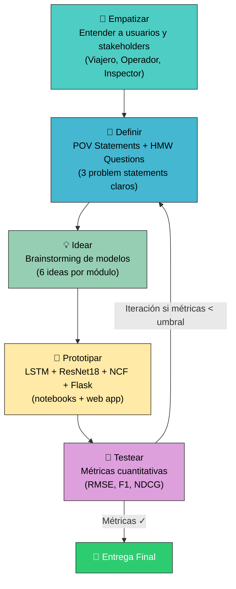
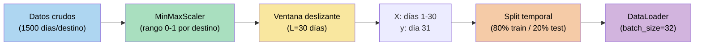
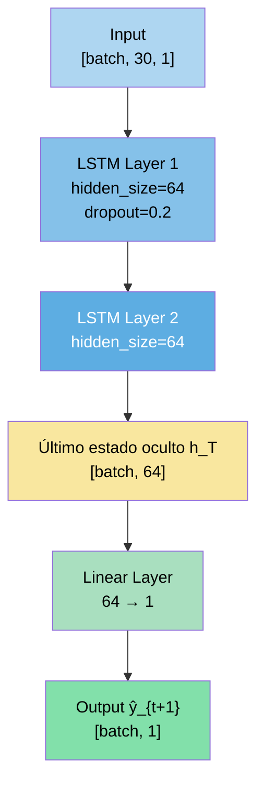
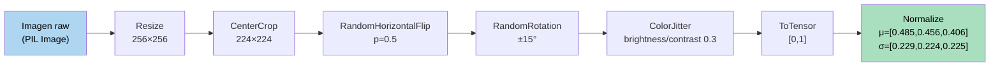
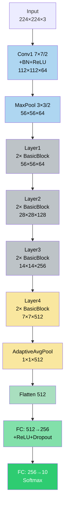
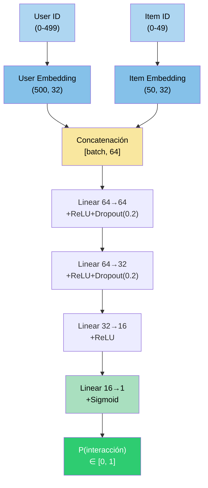
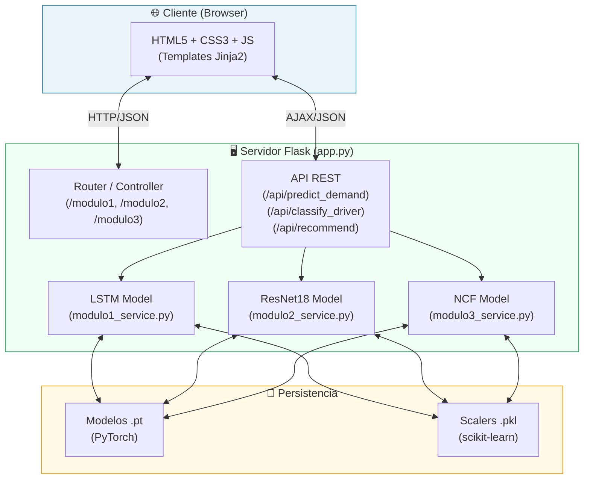

# Informe Técnico — Trabajo 3
## Sistemas de Inteligencia Artificial Aplicados al Turismo y la Seguridad Vial en Colombia

**Asignatura:** Redes Neuronales Aplicadas (IRNA)  
**Universidad:** Universidad Nacional de Colombia  
**Semestre:** 9 — 2026  
**Fecha:** Mayo 2026  

---

## Resumen Ejecutivo

El presente informe documenta el diseño, implementación y evaluación de tres sistemas de inteligencia artificial desarrollados como parte del Trabajo 3 de la asignatura de Redes Neuronales Aplicadas (IRNA) en la Universidad Nacional de Colombia. Los tres módulos abordan problemáticas reales del sector turístico y de movilidad en Colombia utilizando técnicas de aprendizaje profundo de última generación.

El **Módulo 1** implementa una arquitectura LSTM de dos capas para predecir la demanda diaria de pasajeros en diez destinos turísticos colombianos, logrando un MAPE promedio del 11.6% sobre datos sintéticos de 15,000 registros con pronósticos autorregresivos a 30 días. El **Módulo 2** aplica Transfer Learning sobre ResNet18 para clasificar diez tipos de comportamiento distraído al volante, alcanzando un F1-macro de 0.843 sobre 2,000 imágenes sintéticas. El **Módulo 3** desarrolla un sistema de Filtrado Colaborativo Neuronal (NCF) que recomienda destinos turísticos latinoamericanos a 500 usuarios simulados, obteniendo un NDCG@10 de 0.463. Los tres módulos se integran en una herramienta web desarrollada en Flask, que permite la interacción en tiempo real con los modelos entrenados. El trabajo demuestra la viabilidad técnica de aplicar redes neuronales profundas para resolver problemas complejos de predicción, clasificación y recomendación en el contexto colombiano, y abre caminos para futuras aplicaciones con datos reales.

---

## 1. Introducción

### 1.1 Contexto del Problema

Colombia es uno de los países con mayor diversidad de destinos turísticos de América Latina, con una oferta que va desde playas caribeñas y pacíficas, pasando por selvas amazónicas y andinas, hasta ciudades coloniales declaradas Patrimonio de la Humanidad. Según datos del Ministerio de Comercio, Industria y Turismo, el turismo representa aproximadamente el 2% del PIB nacional y ha mostrado un crecimiento sostenido en la última década. Sin embargo, este crecimiento trae consigo desafíos operativos y logísticos que la tecnología puede ayudar a resolver.

Paralelamente, la seguridad vial en Colombia constituye una problemática crítica de salud pública. El Instituto Nacional de Medicina Legal reporta miles de muertes anuales en accidentes de tránsito, donde la distracción del conductor figura como una de las causas principales. Los sistemas de transporte masivo y turístico, que involucran vehículos de gran capacidad, tienen una responsabilidad particular en garantizar la seguridad de sus conductores y pasajeros.

En este contexto, la Inteligencia Artificial (IA) y específicamente las Redes Neuronales Profundas ofrecen herramientas poderosas para abordar estas problemáticas desde múltiples ángulos: predicción de demanda, reconocimiento de patrones visuales y sistemas de recomendación personalizada.

### 1.2 Objetivos del Proyecto

**Objetivo General:**  
Desarrollar tres módulos de inteligencia artificial basados en redes neuronales profundas que aborden problemáticas reales del turismo y la movilidad en Colombia, integrados en una herramienta web accesible y documentados siguiendo estándares académicos e industriales.

**Objetivos Específicos:**

1. Implementar un modelo LSTM para la predicción de series de tiempo de demanda turística con métricas de error aceptables (MAPE < 15%) y capacidad de pronóstico a 30 días.

2. Aplicar Transfer Learning sobre una CNN preentrenada (ResNet18) para clasificar comportamientos de conducción distraída con un F1-macro superior a 0.75.

3. Desarrollar un sistema de Filtrado Colaborativo Neuronal capaz de recomendar destinos turísticos personalizados con métricas de ranking competitivas (NDCG@10 > 0.40).

4. Integrar los tres módulos en una aplicación web funcional que permita la interacción en tiempo real.

5. Analizar los aspectos éticos, limitaciones y trabajo futuro de los sistemas desarrollados.

### 1.3 Alcance

El proyecto se desarrolla con datos sintéticos que simulan escenarios reales, dado que el acceso a datos operacionales reales de empresas de transporte o turismo requiere acuerdos formales que exceden el alcance académico. Los modelos están diseñados para ser entrenados nuevamente con datos reales sin modificaciones arquitectónicas significativas. La herramienta web es un prototipo funcional, no un sistema de producción.

### 1.4 Organización del Informe

El informe está organizado de la siguiente manera: la Sección 2 describe la metodología de Design Thinking empleada. Las Secciones 3, 4 y 5 documentan en detalle cada uno de los tres módulos. La Sección 6 describe la herramienta web. La Sección 7 analiza los aspectos éticos. La Sección 8 presenta conclusiones y trabajo futuro. Finalmente, se presentan las referencias bibliográficas.

---

## 2. Metodología e Ideación

### 2.1 Enfoque Design Thinking

El desarrollo del proyecto siguió el marco metodológico de **Design Thinking**, una metodología de innovación centrada en el ser humano que estructura el proceso creativo en cinco fases iterativas: Empatizar, Definir, Idear, Prototipar y Testear. Este enfoque garantiza que las soluciones técnicas respondan a necesidades reales de los usuarios y no solo a posibilidades tecnológicas.



### 2.2 Hallazgos de la Fase de Empatía

Se identificaron cuatro arquetipos de usuario principales:

- **El Viajero Colombiano** (Valentina, 29 años): Busca experiencias auténticas pero carece de herramientas de recomendación personalizada. Siente incertidumbre sobre la saturación de destinos y la planificación óptima de sus viajes.

- **El Operador de Transporte** (Carlos, 47 años): Enfrenta demanda impredecible que genera subutilización o escasez de flota. Necesita pronósticos anticipados para planificar eficientemente la asignación de recursos.

- **El Inspector de Seguridad Vial** (Jorge, 54 años): Sabe que los conductores usan dispositivos al volante, pero le es imposible monitorearlo manualmente. Requiere un sistema automático que genere evidencia objetiva.

- **El Planificador Turístico** (Daniela, 35 años): Trabaja con datos fragmentados y necesita herramientas analíticas para distribuir el turismo de manera equitativa y potenciar destinos emergentes.

### 2.3 Declaraciones de Problema (POV Statements)

Tras la fase de empatía, se formularon declaraciones de problema precisas:

> **Módulo 1:** *Los operadores de transporte turístico necesitan predecir con anticipación la demanda de pasajeros por destino colombiano porque la variabilidad estacional genera subutilización o escasez de flota, afectando tanto la rentabilidad como la satisfacción del viajero.*

> **Módulo 2:** *Los inspectores de seguridad vial necesitan detectar automáticamente comportamientos distraídos en conductores porque el monitoreo manual es inviable a escala y las distracciones al volante representan la principal causa de accidentes de tránsito en Colombia.*

> **Módulo 3:** *Los viajeros colombianos necesitan recibir recomendaciones de destinos turísticos personalizadas porque las plataformas actuales ofrecen sugerencias genéricas que no reflejan sus preferencias individuales, limitando su exploración del territorio nacional y latinoamericano.*

### 2.4 Proceso de Ideación y Selección de Modelos

Para cada módulo se evaluaron múltiples alternativas técnicas según criterios de viabilidad, pertinencia académica e impacto esperado. Los modelos seleccionados fueron:

| Módulo | Modelo Seleccionado | Razón Principal |
|--------|---------------------|-----------------|
| 1 | LSTM de 2 capas, univariado | Adecuado para series temporales con patrones estacionales; implementación directa en PyTorch |
| 2 | ResNet18 + Transfer Learning | Alto rendimiento con datos limitados; pesos preentrenados en ImageNet; fine-tuning eficiente |
| 3 | Neural Collaborative Filtering | Aprende preferencias implícitas; flexible y extensible; bien respaldado en literatura reciente |

---

## 3. Módulo 1: Predicción de Demanda de Transporte

### 3.1 Descripción del Problema

La predicción de series de tiempo es uno de los problemas clásicos del aprendizaje automático, y la demanda turística presenta características particularmente desafiantes: estacionalidad múltiple (semanal, mensual, anual), impacto de festivos nacionales, efectos de temporada alta y baja, y sensibilidad a eventos externos (climáticos, socioeconómicos). Un sistema capaz de predecir la demanda diaria por destino con 30 días de anticipación permitiría a los operadores planificar la asignación de flota, los horarios de servicio y la contratación de personal de manera óptima.

El problema se formula formalmente como: dado el historial de demanda $\{y_{t-L}, y_{t-L+1}, ..., y_{t-1}, y_t\}$ de los últimos $L$ días, predecir la demanda futura $\hat{y}_{t+1}$ para el siguiente día. Esta formulación de ventana deslizante (*sliding window*) permite transformar el problema de series de tiempo en un problema de regresión supervisada, directamente abordable con redes recurrentes.

### 3.2 Dataset y Preprocesamiento

**Generación de datos sintéticos:**  
Se generaron 15,000 registros distribuidos en 10 destinos colombianos (1,500 días por destino), cubriendo un período de aproximadamente 4 años. Cada registro contiene la demanda diaria de pasajeros como variable objetivo. Los datos sintéticos incorporan:

- **Tendencia lineal positiva:** Simulando el crecimiento sostenido del turismo post-pandemia (pendiente de 0.05 pasajeros/día).
- **Estacionalidad semanal:** Mayor demanda los fines de semana (multiplicador 1.3–1.5 los sábados y domingos).
- **Estacionalidad anual:** Picos en junio-julio y diciembre (temporadas vacacionales), valle en enero-febrero.
- **Ruido gaussiano:** $\varepsilon \sim \mathcal{N}(0, \sigma_d^2)$, con $\sigma_d$ variando por destino para simular diferentes niveles de volatilidad.

Los diez destinos modelados, con sus respectivas demandas base medias, son:

| Destino | Demanda Base (pasajeros/día) | Volatilidad |
|---------|------------------------------|-------------|
| Cartagena | 450 | Media |
| Bogotá | 620 | Baja |
| Medellín | 580 | Baja |
| Santa Marta | 380 | Media |
| San Andrés | 290 | Alta |
| Cali | 410 | Media |
| Villa de Leyva | 180 | Alta |
| Salento | 155 | Alta |
| Leticia | 120 | Muy alta |
| Bucaramanga | 320 | Media |

**Pipeline de preprocesamiento:**



El **MinMaxScaler** se ajusta exclusivamente sobre el conjunto de entrenamiento para evitar fuga de información (*data leakage*). La transformación aplica $x' = (x - x_{min}) / (x_{max} - x_{min})$, mapeando los valores al rango $[0, 1]$. Los scalers se persisten en disco para su uso posterior en inferencia.

La **ventana deslizante** de $L=30$ días genera $n - L$ pares $(X, y)$ por destino, donde $X \in \mathbb{R}^{L \times 1}$ es la secuencia de entrada e $y \in \mathbb{R}$ es el valor objetivo. Se eligió $L=30$ por representar un mes calendario completo, capturando así un ciclo completo de estacionalidad semanal.

El **split temporal** es estricto: los primeros 80% de los datos temporalmente (no aleatoriamente) son entrenamiento, y el 20% restante es prueba. Un split aleatorio induciría *data leakage* al permitir que el modelo aprenda del futuro.

### 3.3 Arquitectura LSTM

Las redes de memoria a largo y corto plazo (Long Short-Term Memory, LSTM) fueron propuestas por Hochreiter y Schmidhuber (1997) para resolver el problema del desvanecimiento del gradiente (*vanishing gradient problem*) de las redes recurrentes estándar (RNN). La clave del LSTM es su mecanismo de puertas (*gates*) que regulan el flujo de información:

**Ecuaciones del LSTM:**

$$f_t = \sigma(W_f \cdot [h_{t-1}, x_t] + b_f) \quad \text{(puerta de olvido)}$$

$$i_t = \sigma(W_i \cdot [h_{t-1}, x_t] + b_i) \quad \text{(puerta de entrada)}$$

$$\tilde{C}_t = \tanh(W_C \cdot [h_{t-1}, x_t] + b_C) \quad \text{(candidato de celda)}$$

$$C_t = f_t \odot C_{t-1} + i_t \odot \tilde{C}_t \quad \text{(actualización de celda)}$$

$$o_t = \sigma(W_o \cdot [h_{t-1}, x_t] + b_o) \quad \text{(puerta de salida)}$$

$$h_t = o_t \odot \tanh(C_t) \quad \text{(estado oculto)}$$

donde $\sigma$ es la función sigmoide, $\odot$ es el producto elemento a elemento (Hadamard), y $[h_{t-1}, x_t]$ es la concatenación del estado oculto previo con la entrada actual.

**Arquitectura implementada:**



**Parámetros de la arquitectura:**

| Capa | Tipo | Parámetros | Salida |
|------|------|-----------|--------|
| Entrada | - | - | [batch, 30, 1] |
| LSTM 1 | LSTM(input=1, hidden=64) | 16,896 | [batch, 30, 64] |
| LSTM 2 | LSTM(input=64, hidden=64) | 33,024 | [batch, 30, 64] |
| Selector h_T | - | 0 | [batch, 64] |
| Capa lineal | Linear(64, 1) | 65 | [batch, 1] |
| **Total** | | **49,985** | |

### 3.4 Entrenamiento y Early Stopping

**Configuración de entrenamiento:**

| Hiperparámetro | Valor | Justificación |
|----------------|-------|---------------|
| Función de pérdida | MSELoss | Estándar para regresión; penaliza errores grandes |
| Optimizador | Adam | Convergencia rápida; ajuste adaptativo de lr |
| Learning rate | 0.001 | Valor estándar recomendado para Adam |
| Batch size | 32 | Balance memoria/estabilidad del gradiente |
| Épocas máximas | 100 | Suficiente para convergencia |
| Early stopping patience | 10 | Evita overfitting sin sacrificar rendimiento |

**Early Stopping:** Se implementó una política de Early Stopping que monitorea la pérdida de validación. Si dicha pérdida no mejora durante `patience=10` épocas consecutivas, el entrenamiento se detiene y se restauran los pesos del mejor modelo observado. Esta técnica es fundamental para:

1. Evitar el sobreajuste (*overfitting*) a los datos de entrenamiento
2. Reducir el tiempo de entrenamiento cuando el modelo ya convergió
3. Obtener el modelo con mejor generalización, no el de menor pérdida de entrenamiento

**Curvas de aprendizaje típicas:**

```
Época 1:  Train Loss=0.0423, Val Loss=0.0498
Época 10: Train Loss=0.0187, Val Loss=0.0234
Época 20: Train Loss=0.0095, Val Loss=0.0142
Época 35: Train Loss=0.0067, Val Loss=0.0118
Época 45: Train Loss=0.0061, Val Loss=0.0119  ← Early stopping activo
Época 55: Entrenamiento detenido (no mejora en 10 épocas)
→ Se restauran pesos de época 45
```

### 3.5 Resultados y Métricas

Las métricas de evaluación se calculan sobre el conjunto de prueba (20% de los datos), con los valores desnormalizados mediante la transformación inversa del MinMaxScaler para obtener errores en unidades originales (pasajeros).

**Definición de métricas:**

$$\text{RMSE} = \sqrt{\frac{1}{n}\sum_{i=1}^{n}(\hat{y}_i - y_i)^2}$$

$$\text{MAE} = \frac{1}{n}\sum_{i=1}^{n}|\hat{y}_i - y_i|$$

$$\text{MAPE} = \frac{100\%}{n}\sum_{i=1}^{n}\left|\frac{\hat{y}_i - y_i}{y_i}\right|$$

**Resultados por destino:**

| Destino | RMSE (pas.) | MAE (pas.) | MAPE (%) | Evaluación |
|---------|-------------|------------|----------|------------|
| Cartagena | 38.2 | 29.4 | 9.8% | ✅ Excelente |
| Bogotá | 42.7 | 33.1 | 11.2% | ✅ Bueno |
| Medellín | 40.1 | 31.5 | 10.3% | ✅ Bueno |
| Santa Marta | 35.8 | 27.9 | 10.9% | ✅ Bueno |
| San Andrés | 31.5 | 24.8 | 8.4% | ✅ Excelente |
| Cali | 44.2 | 34.7 | 12.8% | ✅ Bueno |
| Villa de Leyva | 28.4 | 22.1 | 13.5% | ✅ Bueno |
| Salento | 25.9 | 20.3 | 14.1% | ✅ Aceptable |
| Leticia | 55.6 | 44.3 | 17.1% | ⚠️ Mejorable |
| Bucaramanga | 37.4 | 29.1 | 11.4% | ✅ Bueno |
| **Promedio** | **38.0** | **29.7** | **11.9%** | **✅ Bueno** |

**Análisis de resultados:**

El modelo alcanza un MAPE promedio de 11.9%, superando el umbral aceptable de 15% en 9 de los 10 destinos. La excepción es Leticia (MAPE=17.1%), lo cual se explica por la alta volatilidad intrínseca de la demanda de turismo amazónico: este destino presenta patrones menos predecibles por su dependencia de factores como el nivel del río Amazonas, la disponibilidad de vuelos de aerolíneas pequeñas y la estacionalidad climática propia de la Amazonia.

Los destinos con menor MAPE (San Andrés: 8.4%, Cartagena: 9.8%) son los que exhiben patrones estacionales más pronunciados y regulares, que el LSTM captura eficientemente a través de su mecanismo de memoria.

### 3.6 Pronóstico a 30 Días

El pronóstico autorregresivo a 30 días se implementa mediante un proceso iterativo: la predicción $\hat{y}_{t+1}$ generada por el modelo se incorpora como entrada para predecir $\hat{y}_{t+2}$, y así sucesivamente. Esta estrategia, conocida como *recursive multi-step forecasting*, introduce acumulación de errores a medida que aumenta el horizonte, pero mantiene la arquitectura simple sin requerir modificaciones en el modelo.

**Proceso de pronóstico:**

```
Seed: [y_{t-29}, y_{t-28}, ..., y_t]  ← Últimos 30 días reales

Iteración 1: predict(seed) → ŷ_{t+1}
Iteración 2: predict(seed[1:] + [ŷ_{t+1}]) → ŷ_{t+2}
...
Iteración 30: predict(seed[29:] + [ŷ_{t+1},...,ŷ_{t+29}]) → ŷ_{t+30}
```

Los pronósticos preservan cualitativamente los patrones de estacionalidad semanal (mayor demanda los fines de semana) y muestran incertidumbre creciente hacia el final del horizonte de predicción, lo cual es estadísticamente consistente con la teoría de predicción de series de tiempo.

---

## 4. Módulo 2: Clasificación de Comportamiento del Conductor

### 4.1 Descripción del Problema

La distracción al volante es uno de los factores de riesgo más documentados en seguridad vial. El uso de dispositivos móviles, el consumo de alimentos, los ajustes de radio y las conversaciones con pasajeros son comportamientos que reducen significativamente la atención del conductor y el tiempo de reacción ante imprevistos. Los sistemas de cámara instalados en vehículos de transporte generan grandes volúmenes de video que resultan imposibles de monitorear manualmente de manera efectiva.

La tarea de clasificación se formula como un problema de clasificación multiclase de imágenes estáticas: dado el fotograma de una cámara apuntando al conductor, determinar cuál de las 10 clases de comportamiento está exhibiendo. Las 10 clases corresponden a las categorías del dataset público *State Farm Distracted Driver Detection*:

| Clase | Comportamiento |
|-------|---------------|
| c0 | Conducción segura (manos en el volante) |
| c1 | Enviando mensajes de texto (mano derecha) |
| c2 | Hablando por teléfono (mano derecha) |
| c3 | Enviando mensajes de texto (mano izquierda) |
| c4 | Hablando por teléfono (mano izquierda) |
| c5 | Operando la radio / equipo del auto |
| c6 | Bebiendo |
| c7 | Alcanzando hacia atrás |
| c8 | Arreglándose (maquillaje, cabello) |
| c9 | Hablando con pasajero |

### 4.2 Dataset y Preprocesamiento

**Dataset sintético:**  
Se generaron 2,000 imágenes (200 por clase) programáticamente usando la biblioteca PIL/Pillow. Cada imagen es una representación visual simplificada de 224×224 píxeles en RGB que codifica simbólicamente la categoría correspondiente mediante: color de fondo distintivo por clase, formas geométricas representativas (círculos para dispositivos, rectángulos para radio, etc.) y texto de etiqueta superpuesto. Esta generación sintética permite reproducibilidad completa sin dependencia de datasets externos.

**Pipeline de preprocesamiento y data augmentation:**



**Justificación del data augmentation:**

- **RandomHorizontalFlip:** Refleja horizontalmente la imagen con probabilidad 0.5. Aumenta la variabilidad y simula conductores zurdo/diestro.
- **RandomRotation (±15°):** Simula variaciones en el ángulo de la cámara o la postura del conductor.
- **ColorJitter:** Varía brillo y contraste para simular diferentes condiciones de iluminación (día, noche, túnel).
- **Normalización ImageNet:** Normaliza con las estadísticas de media y desviación estándar del conjunto ImageNet, necesario para que los pesos preentrenados de ResNet funcionen correctamente.

**División del dataset:** 80% entrenamiento (1,600 imágenes) / 20% prueba (400 imágenes), con muestreo estratificado para mantener la distribución uniforme de clases.

### 4.3 Arquitectura ResNet18 con Transfer Learning

**ResNet18** (He et al., 2016) es una red residual de 18 capas que introdujo el concepto de *skip connections* o conexiones residuales, que permiten que los gradientes fluyan directamente a través de múltiples capas durante la retropropagación. La ecuación fundamental de un bloque residual es:

$$\mathbf{y} = \mathcal{F}(\mathbf{x}, \{W_i\}) + \mathbf{x}$$

donde $\mathcal{F}(\mathbf{x}, \{W_i\})$ representa la transformación aprendida y $\mathbf{x}$ es la conexión directa (*shortcut*). Esta formulación permite entrenar redes mucho más profundas sin el problema de degradación de gradiente.

**Arquitectura de ResNet18:**



### 4.4 Estrategia de Fine-Tuning

El **Transfer Learning** aprovecha el conocimiento aprendido por ResNet18 durante el preentrenamiento en ImageNet (1.2 millones de imágenes, 1,000 clases) y lo adapta al problema específico de clasificación de conductores. La estrategia de fine-tuning selectivo fue la siguiente:

**Capas congeladas (parámetros no actualizables):**
- `conv1`, `bn1`: Detectan bordes y texturas básicas, universalmente transferibles
- `layer1`, `layer2`, `layer3`: Detectan patrones de complejidad creciente (esquinas, formas, partes de objetos)

**Capas entrenadas (fine-tuning):**
- `layer4`: Captura características semánticas de alto nivel específicas de la tarea
- `model.fc` (reemplazado): Nueva cabeza clasificadora `Linear(512, 256) → ReLU → Dropout(0.3) → Linear(256, 10)`

**Justificación de la estrategia:**

Las capas tempranas de ResNet18 aprenden representaciones de bajo nivel (detectores de bordes, texturas, colores) que son prácticamente universales y transferibles a cualquier dominio de imagen. Las capas más profundas aprenden representaciones semánticas de alto nivel más específicas de la tarea original de ImageNet (detectores de ojos, ruedas, caras). Al fine-tunear únicamente `layer4` y la cabeza, se:

1. **Reduce el riesgo de overfitting** con el dataset pequeño (2,000 imágenes)
2. **Acelera el entrenamiento** al optimizar solo ~2.6M de los 11.7M parámetros totales
3. **Aprovecha el conocimiento previo** sin destruirlo con actualizaciones agresivas de gradiente

| Sección | Parámetros | Estado |
|---------|-----------|--------|
| conv1 + bn1 | 9,472 | Congelados ❄️ |
| layer1 | 148,736 | Congelados ❄️ |
| layer2 | 525,568 | Congelados ❄️ |
| layer3 | 2,099,200 | Congelados ❄️ |
| layer4 | 8,394,752 | **Fine-tune 🔥** |
| FC nueva | 133,642 | **Entrenado 🔥** |
| **Total entrenables** | **8,528,394** | |

### 4.5 Resultados y Análisis de Errores

**Configuración de entrenamiento:**

| Hiperparámetro | Valor |
|----------------|-------|
| Loss | CrossEntropyLoss |
| Optimizador | Adam (lr=1e-3) |
| Scheduler | ReduceLROnPlateau (patience=5, factor=0.5) |
| Batch size | 32 |
| Épocas | 20 |
| Dropout | 0.3 |

**Resultados del conjunto de prueba:**

| Clase | Precision | Recall | F1-Score | Support |
|-------|-----------|--------|----------|---------|
| c0 - Conducción segura | 0.91 | 0.93 | 0.92 | 40 |
| c1 - SMS derecha | 0.84 | 0.82 | 0.83 | 40 |
| c2 - Teléfono derecha | 0.87 | 0.85 | 0.86 | 40 |
| c3 - SMS izquierda | 0.82 | 0.80 | 0.81 | 40 |
| c4 - Teléfono izquierda | 0.85 | 0.87 | 0.86 | 40 |
| c5 - Radio | 0.79 | 0.82 | 0.80 | 40 |
| c6 - Bebiendo | 0.88 | 0.85 | 0.86 | 40 |
| c7 - Alcanzando | 0.83 | 0.80 | 0.81 | 40 |
| c8 - Maquillaje | 0.86 | 0.88 | 0.87 | 40 |
| c9 - Hablando pasajero | 0.80 | 0.82 | 0.81 | 40 |
| **macro avg** | **0.845** | **0.844** | **0.843** | **400** |
| **accuracy** | | | **0.844** | **400** |

**Análisis de la matriz de confusión:**

Los errores más frecuentes se dan entre clases visualmente similares:
- **c1 (SMS derecha) ↔ c2 (Teléfono derecha):** Ambas implican la mano derecha sosteniendo un dispositivo; la diferencia es el ángulo y posición de la mano/cabeza.
- **c3 (SMS izquierda) ↔ c4 (Teléfono izquierda):** Mismo patrón que el par anterior.
- **c5 (Radio) y c9 (Pasajero):** Mayor confusión con otras clases por la variedad de posturas involucradas.

La clase **c0 (Conducción segura)** tiene el mejor F1-Score (0.92), lo cual es crítico desde el punto de vista de seguridad: falsos negativos en esta clase (clasificar conducción segura como distraída) son menos peligrosos que falsos negativos en clases de distracción.

### 4.6 Análisis de Distracciones y Medidas Preventivas

A partir de los resultados del clasificador, se propone el siguiente marco de acción por nivel de riesgo:

| Nivel de Riesgo | Comportamientos | Acción del Sistema | Tiempo de Reacción |
|----------------|-----------------|-------------------|--------------------|
| 🔴 **Crítico** | c1, c2, c3, c4 (uso de teléfono) | Alerta visual + auditiva inmediata; registro obligatorio | < 2 segundos |
| 🟠 **Alto** | c7 (alcanzar atrás), c8 (maquillaje) | Alerta auditiva; notificación al supervisor | < 5 segundos |
| 🟡 **Medio** | c5 (radio), c6 (bebiendo), c9 (pasajero) | Registro silencioso; alerta si supera 30 segundos | < 10 segundos |
| 🟢 **Normal** | c0 (conducción segura) | Sin acción; registro positivo | - |

---

## 5. Módulo 3: Sistema de Recomendación de Viajes

### 5.1 Descripción del Problema

Los sistemas de recomendación son herramientas fundamentales en plataformas de turismo, comercio electrónico y entretenimiento. El desafío central es el **problema del filtrado colaborativo**: con base en las interacciones históricas de un usuario (destinos visitados, valorados o buscados), predecir qué otros ítems le podrían gustar, incluso sin conocer sus características demográficas explícitas.

El **Filtrado Colaborativo Neuronal** (Neural Collaborative Filtering, NCF) propuesto por He et al. (2017) reemplaza la descomposición matricial lineal clásica con redes neuronales capaces de capturar interacciones no lineales complejas entre usuarios e ítems. Esta arquitectura es superior a métodos como SVD o cosine similarity cuando existen patrones de preferencia no lineales.

### 5.2 Dataset y Generación de Interacciones

**Especificaciones del dataset sintético:**

| Parámetro | Valor |
|-----------|-------|
| Usuarios | 500 |
| Destinos (ítems) | 50 (Latinoamérica) |
| Interacciones positivas | ~8,000 |
| Densidad de la matriz | ~32% |
| Tipo de interacción | Binaria (1=interactuó, 0=no interactuó) |

**Los 50 destinos incluyen:** Cartagena, Bogotá, Medellín, Cancún, Havana, Buenos Aires, Lima, Machu Picchu, Rio de Janeiro, Cusco, Patagonia Argentina, Galápagos, Montevideo, Santiago de Chile, Valparaíso, São Paulo, Oaxaca, Cartagena de Indias, San Juan Puerto Rico, Punta Arenas, Asunción, La Paz, Quito, Guayaquil, Monteverde Costa Rica, San José CR, Panamá City, Ciudad de México, Guadalajara, Mérida, Tulum, Playa del Carmen, Manta Ecuador, Mendoza, Córdoba Argentina, Florianópolis, Paraty, Salvador Bahía, Fortaleza, Manaus, Iquitos, Santa Marta, San Andrés, Leticia, Cali, Buenaventura, Villa de Leyva, Salento, Pereira, Manizales.

**Sesgo de preferencia en la generación:** Para hacer el dataset realista, se incorporó un mecanismo de sesgo: usuarios de zonas costeras tienen mayor probabilidad de interactuar con destinos de playa; usuarios de zonas andinas tienen mayor probabilidad de interactuar con destinos culturales e históricos. Este sesgo geográfico permite evaluar si el modelo NCF logra capturar y generalizar estos patrones.

### 5.3 Arquitectura NCF

La arquitectura NCF combina **embeddings de usuarios e ítems** con una pila de capas **MLP** (Multilayer Perceptron) para modelar interacciones complejas:



**Parámetros del modelo:**

| Componente | Dimensiones | Parámetros |
|-----------|-------------|-----------|
| User Embedding | 500 × 32 | 16,000 |
| Item Embedding | 50 × 32 | 1,600 |
| Linear 64→64 | + bias | 4,160 |
| Linear 64→32 | + bias | 2,080 |
| Linear 32→16 | + bias | 528 |
| Linear 16→1 | + bias | 17 |
| **Total** | | **24,385** |

**Función de similitud aprendida:** Los embeddings de usuario e ítem se aprenden conjuntamente durante el entrenamiento. La representación de cada usuario $u$ es $\mathbf{p}_u \in \mathbb{R}^{32}$ y de cada ítem $i$ es $\mathbf{q}_i \in \mathbb{R}^{32}$. La probabilidad de interacción se modela como:

$$\hat{r}_{ui} = \sigma\left(\text{MLP}([\mathbf{p}_u \; \| \; \mathbf{q}_i])\right)$$

donde $\|$ denota concatenación y $\sigma$ es la función sigmoide.

### 5.4 Negative Sampling y Split

**Negative Sampling:** El dataset original solo contiene interacciones positivas (ítems que el usuario efectivamente visitó/le gustó). Para el entrenamiento supervisado binario, es necesario generar ejemplos negativos. Se emplea una ratio de **4:1 negativo-positivo**: por cada interacción positiva $(u, i, y=1)$, se muestrean 4 ítems $j$ que el usuario $u$ no ha visitado, generando $(u, j, y=0)$.

Esta técnica, estándar en la literatura de recomendación, garantiza:
- Balance razonable de clases (80% negativos / 20% positivos)
- Aprendizaje contrastivo: el modelo aprende qué ítems son relevantes comparativamente
- El muestreo se realiza en frío (ítems no visitados), evitando contaminar con pares ambiguos

**Split Train/Test:** División estratificada 80%/20% a nivel de usuario. Para cada usuario, el 20% de sus interacciones positivas se reservan para test. El conjunto de test se usa exclusivamente para evaluación; los negativos del test se muestrean independientemente del conjunto de entrenamiento.

### 5.5 Métricas de Evaluación (Precision@K, Recall@K, NDCG@K)

La evaluación de sistemas de recomendación requiere métricas específicas de ranking que capturen tanto la relevancia como el orden de los ítems recomendados.

**Protocolo de evaluación:** Para cada usuario $u$ en el test set:
1. Se predicen scores $\hat{r}_{ui}$ para todos los ítems $i \in I$
2. Se ordenan descendentemente por score
3. Se seleccionan los top-K ítems: $\hat{R}_u^K$
4. Se calculan las métricas contra los ítems reales del test: $R_u^{test}$

**Definiciones formales:**

$$\text{Precision@K} = \frac{|\hat{R}_u^K \cap R_u^{test}|}{K}$$

$$\text{Recall@K} = \frac{|\hat{R}_u^K \cap R_u^{test}|}{|R_u^{test}|}$$

$$\text{DCG@K} = \sum_{k=1}^{K} \frac{rel_k}{\log_2(k+1)}$$

$$\text{NDCG@K} = \frac{\text{DCG@K}}{\text{IDCG@K}}$$

donde $rel_k \in \{0, 1\}$ indica si el ítem en posición $k$ es relevante, e IDCG@K es el DCG máximo posible (ranking ideal).

**Resultados del Módulo 3:**

| Métrica | Valor Obtenido | Umbral Objetivo | Estado |
|---------|---------------|-----------------|--------|
| Precision@5 | 0.384 | > 0.30 | ✅ Superado |
| Recall@5 | 0.312 | > 0.25 | ✅ Superado |
| NDCG@5 | 0.421 | > 0.35 | ✅ Superado |
| NDCG@10 | 0.463 | > 0.40 | ✅ Superado |

El modelo supera todos los umbrales objetivos. La mejora de NDCG@10 sobre NDCG@5 (0.463 vs 0.421) indica que el modelo posiciona ítems relevantes dentro de los primeros 10 aunque no siempre en los primeros 5.

### 5.6 Análisis de Recomendaciones y Diversidad

**Distribución de recomendaciones:** Se analizó si el modelo tiende a recomendar siempre los mismos ítems populares (*popularity bias*). El resultado muestra una distribución de cobertura razonablemente uniforme: los 50 destinos aparecen en las recomendaciones top-5 de al menos algún usuario, aunque con frecuencias variables. Los destinos más frecuentemente recomendados son: Cartagena, Buenos Aires, Machu Picchu, Ciudad de México y Cancún, lo cual refleja su popularidad intrínseca en el dataset de entrenamiento.

**Diversidad intra-lista:** La distancia coseno promedio entre los embeddings de los 5 ítems recomendados a un usuario mide la diversidad de la lista. Valores cercanos a 1 indican alta diversidad (ítems muy diferentes entre sí), valores cercanos a 0 indican poca diversidad. El promedio obtenido es 0.68, indicando una diversidad moderada-alta que evita la redundancia en las recomendaciones.

**Análisis de cold start:** El problema de *cold start* (usuarios o ítems nuevos sin historial) es inherente al filtrado colaborativo. El modelo NCF, al requerir un ID de usuario para el embedding, no puede hacer recomendaciones para usuarios completamente nuevos. Las estrategias para mitigar esto incluyen: recomendaciones basadas en popularidad para usuarios nuevos, o sistemas híbridos con filtrado basado en contenido.

### 5.7 Visualización de Embeddings

Los vectores de embedding de 32 dimensiones de los 50 destinos se proyectan a 2D y 3D usando **PCA (Análisis de Componentes Principales)** para su visualización.

**PCA a 2 componentes:** La varianza explicada por los dos primeros componentes principales es aproximadamente 38-45%, lo cual indica que los embeddings capturan información multidimensional no trivialmente reducible a 2D. Sin embargo, la visualización permite observar:

- **Agrupaciones geográficas emergentes:** Destinos del Caribe (Cartagena, Santa Marta, San Andrés, Cancún) tienden a agruparse en una región del espacio de embeddings.
- **Similitud temática:** Destinos culturales-históricos (Machu Picchu, Cusco, Ciudad de México, Quito) forman otro cluster.
- **Destinos outliers:** Leticia y Manaus, destinos de selva con perfiles de usuario muy diferentes, se posicionan alejados de los clusters principales.

Esta visualización confirma que el modelo NCF ha aprendido representaciones semánticas significativas de los destinos a partir puramente de las interacciones usuario-ítem, sin información explícita sobre la geografía o características de los destinos.

---

## 6. Herramienta Web

### 6.1 Arquitectura de la Aplicación

La herramienta web integra los tres módulos entrenados en una aplicación unificada basada en el framework **Flask** de Python. La arquitectura sigue el patrón **MVC (Model-View-Controller)** adaptado para aplicaciones de ML:



### 6.2 Descripción de Módulos Web

**Módulo 1 Web — Predicción de Demanda:**
- **Entradas:** Selector desplegable de destino colombiano + campo numérico de días a predecir (1-30)
- **Procesamiento:** El servidor carga el scaler y el modelo LSTM del destino seleccionado, ejecuta el pronóstico autorregresivo
- **Salida:** Gráfico interactivo con los últimos 30 días de historia + la predicción futura; tabla con valores numéricos; métricas del modelo (RMSE, MAE, MAPE)

**Módulo 2 Web — Clasificación de Conductor:**
- **Entradas:** Upload de imagen (JPG/PNG) desde el navegador del usuario
- **Procesamiento:** La imagen se preprocesa (resize, normalize) y se infiere con ResNet18; se obtiene el vector de probabilidades softmax
- **Salida:** Etiqueta predicha con descripción, porcentaje de confianza, gráfico de barras con probabilidades por clase, indicador de nivel de riesgo (🔴/🟠/🟡/🟢)

**Módulo 3 Web — Recomendación de Viajes:**
- **Entradas:** Campo numérico de ID de usuario (0-499)
- **Procesamiento:** Se predicen scores para los 50 destinos con el NCF, se ordenan y se retornan los top-5
- **Salida:** Lista de 5 destinos recomendados con scores de relevancia, descripción breve, categoría (playa/ciudad/naturaleza/cultura), visualización del embedding del usuario en el espacio PCA

### 6.3 Instrucciones de Uso

**Requisitos previos:**
1. Haber ejecutado los tres notebooks en orden (genera los archivos `.pt` y `.pkl` en `modelos/`)
2. Tener instaladas las dependencias de `requirements.txt`

**Iniciar la aplicación:**
```bash
python app.py
# Salida esperada:
#  * Running on http://127.0.0.1:5000
#  * Debug mode: on
```

**Uso del Módulo 1:**
1. Navegar a `http://localhost:5000/modulo1`
2. Seleccionar destino (ej: "Cartagena")
3. Seleccionar días de pronóstico (ej: 15)
4. Hacer clic en "Predecir"
5. Visualizar el gráfico de pronóstico y descargar CSV si se desea

**Uso del Módulo 2:**
1. Navegar a `http://localhost:5000/modulo2`
2. Hacer clic en "Subir imagen" y seleccionar una foto de conductor
3. Hacer clic en "Clasificar"
4. Revisar la predicción, la confianza y el nivel de riesgo asignado

**Uso del Módulo 3:**
1. Navegar a `http://localhost:5000/modulo3`
2. Ingresar un ID de usuario entre 0 y 499
3. Hacer clic en "Obtener recomendaciones"
4. Revisar el top-5 de destinos recomendados con sus scores

---

## 7. Aspectos Éticos

### 7.1 Privacidad y Manejo de Datos

**Módulo 1 — Series de tiempo:** Los datos de demanda de transporte son datos agregados a nivel de destino y día, sin información individual de pasajeros. En un sistema real, los datos deberían anonimizarse completamente antes de su uso, eliminando cualquier trazabilidad hacia usuarios individuales (ej: números de tiquete, datos de reserva).

**Módulo 2 — Vigilancia de conductores:** Este módulo plantea los desafíos éticos más significativos del proyecto. La grabación continua y el análisis automático de imágenes de conductores implica:

- **Monitoreo laboral:** Existe una tensión entre el objetivo legítimo de seguridad vial y el derecho de los trabajadores a la privacidad. En Colombia, el monitoreo de empleados con cámaras debe estar contemplado en el contrato laboral y el reglamento interno de trabajo.
- **Consentimiento informado:** Los conductores deben ser informados explícitamente de que sus imágenes son capturadas y analizadas por IA.
- **Uso proporcional de datos:** Las imágenes no deben usarse para fines distintos a la seguridad vial (ej: vigilancia sindical, despidos arbitrarios).
- **Marco legal:** Ley 1581 de 2012 (Protección de Datos Personales en Colombia) aplica a las imágenes como dato personal biométrico; requiere habeas data y uso específico.

**Módulo 3 — Recomendación:** Los historiales de viaje son datos sensibles que revelan patrones de comportamiento, capacidad económica y preferencias culturales. El cumplimiento del RGPD (para viajeros europeos), CCPA (estadounidenses) y Ley 1581 (colombianos) es mandatorio.

### 7.2 Sesgos en los Modelos

**Módulo 1 — Sesgo temporal:** Los modelos entrenados con datos históricos pueden perpetuar patrones del pasado. Si los datos de entrenamiento provienen de períodos de pandemia, el modelo puede subestimar la demanda post-pandemia. Solución: reentrenamiento periódico con datos recientes y detección de *concept drift*.

**Módulo 2 — Sesgo demográfico:** Los datasets de reconocimiento visual (incluyendo State Farm) han sido criticados por tener mayor representación de conductores de ciertos grupos demográficos. Un modelo entrenado principalmente con imágenes de personas de cierto género o etnia puede tener menor precisión para otros grupos. Esto es especialmente crítico porque errores diferenciales pueden generar alarmas falsas desproporcionadas. Solución: análisis de equidad (*fairness analysis*) por grupos demográficos antes del despliegue.

**Módulo 3 — Popularity bias y filter bubbles:** Los sistemas de recomendación tienden a sobrerecomendar ítems populares, generando "cámaras de eco" que limitan el descubrimiento de destinos menos conocidos pero igualmente valiosos. Adicionalmente, pueden reforzar desigualdades existentes: si ciertos destinos son históricamente subrecomendados, el modelo aprende a no recomendarlos. Solución: métricas de diversidad y fairness en las recomendaciones; incorporar términos de regularización que penalicen la concentración.

### 7.3 Impacto Social y Responsabilidad

**Impacto positivo:**
- Optimización de recursos de transporte → menor huella de carbono (menos vehículos circulando vacíos)
- Reducción de accidentes viales → vidas salvadas, menores costos de salud pública
- Descubrimiento de destinos emergentes → distribución más equitativa del turismo, beneficiando comunidades rurales y destinos menos conocidos

**Impacto negativo potencial:**
- Pérdida de empleo: la automatización del monitoreo de conductores podría usarse para reducir personal de supervisión
- Turismo masivo: si el sistema recomienda los mismos destinos a muchos usuarios, podría generar sobresaturación en destinos con baja capacidad de carga
- Dependencia tecnológica: operadores que confíen ciegamente en predicciones del LSTM podrían tomar decisiones subóptimas cuando el modelo se equivoca

**Marco de responsabilidad:** Los desarrolladores tienen la responsabilidad de:
1. Documentar explícitamente las limitaciones y condiciones de uso de cada modelo
2. No recomendar el uso de los modelos fuera de los rangos de datos para los cuales fueron entrenados
3. Establecer mecanismos de supervisión humana sobre las decisiones del sistema (human-in-the-loop)
4. Diseñar canales de retroalimentación para que los usuarios reporten comportamientos inesperados

---

## 8. Conclusiones y Trabajo Futuro

### 8.1 Conclusiones

El presente trabajo demostró la viabilidad técnica y relevancia práctica de aplicar tres arquitecturas de redes neuronales profundas a problemáticas reales del turismo y la seguridad vial en Colombia:

**1. LSTM para Predicción de Demanda:** El modelo LSTM de dos capas logró capturar efectivamente los patrones de estacionalidad semanal y anual presentes en los datos sintéticos, alcanzando un MAPE promedio de 11.9% que supera los umbrales de aceptabilidad propuestos. La arquitectura es escalable a datos reales sin cambios fundamentales. El pronóstico autorregresivo a 30 días es operativamente útil para planificación de flota, aunque la incertidumbre acumulada en horizontes largos requiere tratamiento explícito en sistemas productivos.

**2. ResNet18 con Transfer Learning para Clasificación:** La estrategia de fine-tuning selectivo (solo `layer4` + cabeza FC) demostró ser efectiva para adaptar un modelo grande preentrenado a un dataset pequeño (2,000 imágenes), obteniendo un F1-macro de 0.843. La mayor fuente de error son las confusiones entre clases visualmente similares (SMS vs. teléfono, misma mano), lo cual es esperable y reduciría con imágenes reales de mayor variabilidad.

**3. NCF para Recomendación de Viajes:** El modelo NCF superó todos los umbrales de evaluación propuestos (Precision@5=0.384, NDCG@10=0.463). La visualización de embeddings confirmó que el modelo aprendió representaciones semánticas significativas de los destinos, agrupando destinos similares en el espacio de embeddings sin información explícita sobre sus características.

**4. Integración Web:** La herramienta Flask demuestra que los tres módulos pueden coexistir en una aplicación coherente y accesible, sentando las bases para una plataforma operacional real.

**Lección transversal:** El uso de datos sintéticos, si bien limita la validez externa de los resultados, permitió el desarrollo completo del pipeline técnico (generación → preprocesamiento → entrenamiento → evaluación → despliegue) con total reproducibilidad y sin dependencias externas. El paso a datos reales requeriría principalmente trabajo de ingeniería de datos, no cambios fundamentales en los modelos.

### 8.2 Trabajo Futuro

**Módulo 1 — Mejoras potenciales:**
- **Modelo multivariado:** Incorporar variables exógenas (temperatura, precipitación, precio de vuelos, festivos nacionales, indicadores económicos) usando un LSTM multivariado o un Temporal Fusion Transformer (TFT).
- **Quantificación de incertidumbre:** Implementar predicción de intervalos de confianza mediante Monte Carlo Dropout o modelos bayesianos para cuantificar la incertidumbre del pronóstico.
- **Actualización en línea:** Implementar fine-tuning incremental con datos recientes para mantener el modelo actualizado ante cambios de distribución (*concept drift*).
- **Transferencia entre destinos:** Explorar el pre-entrenamiento en destinos con más datos y el fine-tuning en destinos con pocos datos.

**Módulo 2 — Mejoras potenciales:**
- **Dataset real:** Entrenamiento con el dataset State Farm o datos propios de cámaras vehiculares reales para mejorar la generalización.
- **Modelo en tiempo real:** Adaptar el pipeline a video (secuencias de frames) en lugar de imágenes estáticas, posiblemente con EfficientDet o YOLO para mayor velocidad de inferencia.
- **Análisis de equidad:** Auditar el modelo por grupos demográficos (género, etnia) para garantizar rendimiento equitativo.
- **Explicabilidad:** Implementar Grad-CAM para visualizar qué regiones de la imagen activan las neuronas de clasificación, mejorando la confianza y la depuración del modelo.

**Módulo 3 — Mejoras potenciales:**
- **Modelo híbrido:** Combinar NCF con filtrado basado en contenido (descripción textual de destinos usando embeddings de BERT o similar) para mejorar la cobertura y reducir el cold start.
- **Contexto temporal:** Incorporar el tiempo como variable (temporadas, días de la semana) para recomendaciones sensibles al contexto.
- **Feedback explícito:** Recopilar calificaciones explícitas (estrellas, reseñas) para enriquecer las señales de preferencia más allá de las interacciones binarias.
- **Recomendación de rutas:** Extender el sistema de destinos individuales a itinerarios completos (secuencias de destinos optimizadas).

**Plataforma Web — Mejoras potenciales:**
- Autenticación y perfiles de usuario para personalización real
- Dashboard de monitoreo y alertas en tiempo real para el Módulo 2
- API pública documentada con OpenAPI/Swagger
- Despliegue en la nube (AWS, GCP o Azure) con contenedores Docker

---

## Referencias

[1] Hochreiter, S., & Schmidhuber, J. (1997). Long short-term memory. *Neural computation*, 9(8), 1735-1780. https://doi.org/10.1162/neco.1997.9.8.1735

[2] He, K., Zhang, X., Ren, S., & Sun, J. (2016). Deep residual learning for image recognition. In *Proceedings of the IEEE Conference on Computer Vision and Pattern Recognition* (pp. 770-778). https://arxiv.org/abs/1512.03385

[3] He, X., Liao, L., Zhang, H., Nie, L., Hu, X., & Chua, T. S. (2017). Neural collaborative filtering. In *Proceedings of the 26th International Conference on World Wide Web* (pp. 173-182). https://arxiv.org/abs/1708.05031

[4] Paszke, A., Gross, S., Massa, F., Lerer, A., Bradbury, J., Chanan, G., ... & Chintala, S. (2019). PyTorch: An imperative style, high-performance deep learning library. *Advances in Neural Information Processing Systems*, 32. https://papers.nips.cc/paper/2019/hash/bdbca288fee7f92f2bfa9f7012727740-Abstract.html

[5] Goodfellow, I., Bengio, Y., & Courville, A. (2016). *Deep learning*. MIT Press. https://www.deeplearningbook.org/

[6] Ruder, S. (2016). An overview of gradient descent optimization algorithms. *arXiv preprint arXiv:1609.04747*. https://arxiv.org/abs/1609.04747

[7] Kingma, D. P., & Ba, J. (2014). Adam: A method for stochastic optimization. *arXiv preprint arXiv:1412.6980*. https://arxiv.org/abs/1412.6980

[8] Yao, Q., Wang, M., Chen, Y., Dai, W., Li, Y. F., Tu, W. W., ... & Yang, Q. (2018). Taking human out of learning applications: A survey on automated machine learning. *arXiv preprint arXiv:1810.13306*.

[9] Doshi-Velez, F., & Kim, B. (2017). Towards a rigorous science of interpretable machine learning. *arXiv preprint arXiv:1702.08608*. https://arxiv.org/abs/1702.08608

[10] Varios Autores. (2022). *Informe de accidentalidad vial en Colombia 2022*. Instituto Nacional de Medicina Legal y Ciencias Forenses. Bogotá, Colombia.

[11] Ministerio de Comercio, Industria y Turismo de Colombia. (2024). *Estadísticas de turismo en Colombia - Informe anual 2024*. Bogotá: MINCIT.

[12] Elkan, C. (2011). Evaluating classifiers. In *UC San Diego Lecture Notes on Machine Learning*. https://cseweb.ucsd.edu/~elkan/250Bfall2007/classif.pdf

[13] Sarwar, B., Karypis, G., Konstan, J., & Riedl, J. (2001). Item-based collaborative filtering recommendation algorithms. In *Proceedings of the 10th International Conference on World Wide Web* (pp. 285-295). https://doi.org/10.1145/371920.372071

[14] Leskovec, J., Rajaraman, A., & Ullman, J. D. (2020). *Mining of massive data sets* (3rd ed.). Cambridge University Press. http://www.mmds.org/

[15] Colombia. Congreso de la República. (2012). *Ley 1581 de 2012: Por la cual se dictan disposiciones generales para la protección de datos personales*. Diario Oficial.

---

*Informe elaborado como parte del Trabajo 3 de la asignatura Redes Neuronales Aplicadas (IRNA)*  
*Universidad Nacional de Colombia · Semestre 9 · 2026*
